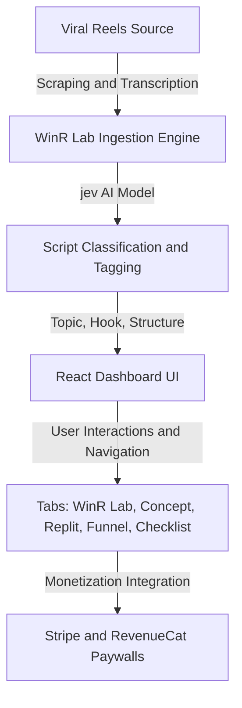

# WinR Lab (jev Hook Classifier)

> AI-powered viral reel decoder and script classification engine for creators, built to analyze hooks and scale monetization effortlessly.

---

## 🛠️ Installation & Setup

Follow these steps to run WinR Lab locally on your machine:

### Prerequisites
- Node.js (v18+ recommended)
- npm or yarn

### 1. Clone the repository
```bash
git clone https://github.com/your-username/winr-lab-jev.git
cd winr-lab-jev
```

### 2. Install dependencies
```bash
npm install
```

### 3. Run the development server
```bash
npm run dev
```
Open your browser and navigate to `http://localhost:3000`.

---

## 🚀 Quick Tutorial

1. **Explore the Archive:** Browse the viral reel archive grid on the dashboard. Click on any reel card to load its detailed metrics.
2. **Inspect Inside the Reel:** View the selected video's **Topic**, **Hook**, and **Structure** along with their AI confidence progress bars, quote, plays, and likes.
3. **Run Live Simulation:** Click the **Run Live** button in the top navigation to simulate real-time script classification and cost increments.
4. **Explore Blueprints:** Use the top menu tabs to inspect the **Concept**, **Replit & RevenueCat** blueprint, **Funnel** projections, and **Checklist**.

---

## 📐 Architecture Diagram



---

## 📜 License
Licensed under the Apache 2.0 License.
